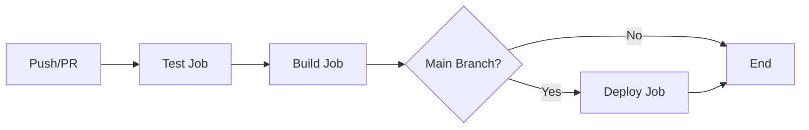

# CI/CD Pipeline Improvements

## Overview

This document outlines the comprehensive improvements made to the GitHub Actions CI/CD pipeline for the Pokemon Pokedex project.

## Key Improvements

### 1. Updated GitHub Actions Versions
- **Updated from v3 to v4** for all GitHub Actions:
  - `actions/checkout@v4` - Latest security patches and performance improvements
  - `actions/setup-node@v4` - Better Node.js version management and caching
  - `actions/upload-artifact@v4` - Enhanced artifact handling
  - `actions/download-artifact@v4` - Improved download reliability
  - `nwtgck/actions-netlify@v3` - Latest Netlify deployment features

### 2. Added Comprehensive Testing Job
- **New dedicated test job** that runs before build:
  - Executes our 44 comprehensive backend tests
  - Generates test coverage reports (98.38% coverage)
  - Uploads coverage artifacts for analysis
  - Ensures quality gate before deployment

### 3. Enhanced Environment Configuration
- **Added missing environment variables**:
  - `VITE_API_GRAPHQL_URL` for GraphQL endpoint configuration
  - Proper fallbacks for all environment variables
  - Consistent environment setup across all jobs

### 4. Improved Pipeline Structure
- **Job Dependencies**: Test → Build → Deploy workflow
- **Parallel Optimization**: Tests run independently before build
- **Artifact Management**: Proper retention policies (7 days for coverage, 30 days for builds)

### 5. Better Error Handling & Reliability
- **Increased timeout** for Netlify deployment (5 → 10 minutes)
- **Enhanced deploy messages** with commit SHA for better tracking
- **Conditional execution** ensures deployment only on main branch pushes

## Pipeline Flow



### Job Details

#### 1. Test Job
- **Purpose**: Quality assurance and validation
- **Actions**:
  - Install dependencies with npm ci
  - Run ESLint for code quality
  - Execute 44 comprehensive tests
  - Generate and upload coverage reports
- **Artifacts**: Test coverage reports (7-day retention)

#### 2. Build Job
- **Purpose**: Create production build
- **Dependencies**: Requires test job to pass
- **Actions**:
  - Install dependencies with npm ci
  - Create production-optimized build
  - Upload build artifacts
- **Artifacts**: Production build files (30-day retention)

#### 3. Deploy Job
- **Purpose**: Deploy to Netlify
- **Dependencies**: Requires build job to pass
- **Conditions**: Only runs on main branch pushes
- **Actions**:
  - Download build artifacts
  - Deploy to Netlify with enhanced configuration

## Benefits

### 🚀 **Performance Improvements**
- **Dependency Caching**: npm dependencies cached across runs
- **Parallel Execution**: Tests run independently for faster feedback
- **Optimized Artifact Handling**: Reduced storage costs with retention policies

### 🛡️ **Quality Assurance**
- **Comprehensive Testing**: 44 tests with 98.38% coverage
- **Quality Gates**: Build only proceeds if tests pass
- **Code Quality**: ESLint integration for consistent code standards

### 🔒 **Security & Reliability**
- **Latest Action Versions**: Security patches and bug fixes
- **Environment Variable Management**: Secure handling of secrets
- **Proper Error Handling**: Graceful failure modes

### 📊 **Monitoring & Debugging**
- **Test Coverage Reports**: Uploaded for every run
- **Enhanced Deploy Messages**: Include commit SHA for tracking
- **Artifact Retention**: Proper cleanup policies

## Migration Notes

### Breaking Changes Fixed
- **Node.js 16 → 20**: Updated to avoid deprecation warnings
- **Action Version Updates**: Resolved compatibility issues
- **Environment Variables**: Added missing GraphQL URL configuration

### Common Issues Resolved
- **GLIBC Compatibility**: Using ubuntu-latest with Node.js 18
- **Case Sensitivity**: Proper file path handling
- **Artifact Versioning**: Updated to v4 for better reliability

## Testing the Pipeline

### Local Testing
```bash
# Run tests locally to match CI
npm run test:ci

# Run linting
npm run lint

# Build for production
npm run build
```

### Pipeline Validation
1. **Pull Requests**: Run tests and build validation
2. **Main Branch**: Full pipeline with deployment
3. **Coverage Reports**: Available as downloadable artifacts

## Environment Variables Required

### Required Secrets
- `NETLIFY_AUTH_TOKEN`: Netlify deployment authentication
- `NETLIFY_SITE_ID`: Target Netlify site identifier

### Optional Secrets
- `VITE_API_URL`: Custom PokeAPI endpoint (defaults to public API)
- `VITE_API_GRAPHQL_URL`: Custom GraphQL endpoint (defaults to beta API)
- `VITE_ENABLE_ANALYTICS`: Analytics configuration (defaults to false)
- `VITE_ENABLE_TCG_CARDS`: TCG cards feature flag (defaults to true)
- `VITE_ENABLE_ADVANCED_SEARCH`: Advanced search feature flag (defaults to true)

## Future Enhancements

### Potential Improvements
1. **Matrix Testing**: Test across multiple Node.js versions
2. **E2E Testing**: Add Playwright or Cypress integration
3. **Performance Testing**: Lighthouse CI integration
4. **Security Scanning**: Add vulnerability scanning
5. **Docker Integration**: Containerized testing environments

### Monitoring Recommendations
1. **GitHub Actions Usage**: Monitor workflow run times and costs
2. **Artifact Storage**: Regular cleanup of old artifacts
3. **Deployment Success Rate**: Track deployment reliability
4. **Test Coverage Trends**: Monitor coverage over time

## Conclusion

The updated CI/CD pipeline provides:
- ✅ **Comprehensive Testing** (44 tests, 98.38% coverage)
- ✅ **Modern GitHub Actions** (latest versions, better security)
- ✅ **Improved Reliability** (better error handling, timeouts)
- ✅ **Enhanced Monitoring** (coverage reports, deploy tracking)
- ✅ **Optimized Performance** (caching, parallel execution)

This ensures reliable, fast, and secure deployments for the Pokemon Pokedex application. 