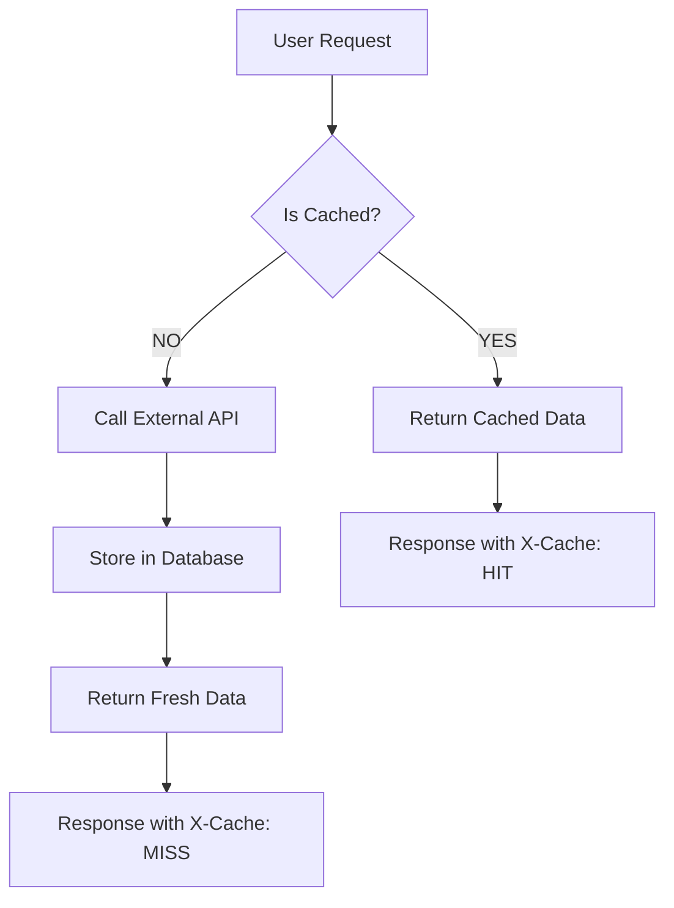

# React Pokédex

A modern, feature-rich Pokédex application built with React, TypeScript, and Tailwind CSS. This application provides comprehensive information about Pokémon, including detailed stats, evolutions, moves, and trading cards.

## Features

### Core Features
- User authentication with email/password and Google login
- Personal favorites collection for registered users
- User profiles with customizable avatars
- Infinite scrolling through Pokémon database
- Advanced filtering system with multiple criteria
- Detailed Pokémon information pages
- Smooth loading animations and transitions
- Fully responsive design for all devices

### Filtering System
- Filter Pokémon by:
  - Types (Fire, Water, Grass, etc.)
  - Moves (specific attacks and abilities)
  - Generation (I through IX)
  - Weight range
  - Height range
  - Evolution status
  - Mega evolution capability

### Pokémon Details
- Comprehensive stats visualization
- Evolution chains with evolution methods
- Complete move lists with details
- Type effectiveness chart
- Abilities and hidden abilities
- SEO-optimized content with canonical URLs

### Trading Card Game
- View Pokémon trading cards
- Interactive card display with animations
- Card rarity and set information
- Modal view for larger card images

### UI Enhancements
- Related Pokémon carousel for easy navigation
- Type-themed color schemes for Pokémon pages
- Animated transitions between pages
- Dark mode support

## Technologies Used

- **Frontend Framework**: React with TypeScript
- **Styling**: Tailwind CSS for responsive design
- **Routing**: React Router for navigation
- **State Management**: React Hooks and Context API
- **Data Fetching**: GraphQL with PokeAPI
- **Authentication**: Supabase Auth with Google OAuth integration
- **Database**: Supabase PostgreSQL for user data and favorites
- **API Caching**: Supabase Edge Functions for intelligent caching
- **Performance Optimization**:
  - Intersection Observer API for infinite scrolling
  - React.memo for component memoization
  - Debounced search inputs
  - Edge function caching for external API calls
- **SEO**: React Helmet Async for metadata management
- **Animations**: CSS transitions and transforms

## 🚀 API Caching System

This application features a sophisticated caching system built with **Supabase Edge Functions** to optimize performance and reduce external API costs.

### How It Works

The caching system consists of three main components:

#### 1. **Supabase Edge Functions**
- **GraphQL Edge Function** (`supabase/functions/graphql/index.ts`): Handles GraphQL queries to PokeAPI
- **REST Edge Function** (`supabase/functions/rest/index.ts`): Handles REST API calls to PokeAPI
- Both functions run on Supabase's global edge network, closer to users for reduced latency

#### 2. **Database Cache Layer**
- Uses a dedicated `api_cache` table in Supabase PostgreSQL
- Stores API responses with cache keys, data, and expiration timestamps
- Includes automatic cleanup functions for expired cache entries

#### 3. **Intelligent Cache Strategy**
The system implements different cache durations based on data volatility:

| Data Type | Cache Duration | Reasoning |
|-----------|---------------|-----------|
| Individual Pokémon | 24 hours | Rarely changes, frequently accessed |
| Moves/Abilities/Types | 24 hours | Static reference data |
| Pokémon Lists | 6 hours | Updated regularly but not frequently |
| General Queries | 1 hour | Default for other API calls |

### Cache Architecture



### Benefits

- **⚡ Performance**: Edge functions reduce latency by running closer to users
- **💰 Cost Reduction**: Significantly reduces external API calls
- **🔄 Reliability**: Automatic fallback to direct API if caching fails
- **📊 Monitoring**: Cache hit/miss headers for performance tracking
- **🧹 Maintenance**: Automatic cleanup of expired cache entries

### Cache Headers

The system provides detailed cache information through response headers:

- `X-Cache`: `HIT` or `MISS` indicating cache status
- `X-Cache-Duration`: Cache duration in seconds
- `Cache-Control`: Standard HTTP caching directives

### Testing the Cache

Run the comprehensive caching test:

```bash
node test-caching.js
```

The test will verify:
- ✅ Cache hit/miss behavior
- ✅ Performance improvements
- ✅ Different cache durations
- ✅ Error handling
- ✅ Database connectivity

#### Example Test Results
```
🚀 Starting Comprehensive Caching Tests
✓ First request should be MISS, got MISS
✓ Second request should be HIT, got HIT
🚀 Cache speedup: 175ms faster
📈 Average response time: 255.6ms
🎯 Cache hit rate: 5/5 (100.0%)
```

### Cache Database Schema

```sql
CREATE TABLE api_cache (
  id SERIAL PRIMARY KEY,
  cache_key TEXT NOT NULL UNIQUE,
  data TEXT NOT NULL,
  created_at TIMESTAMP WITH TIME ZONE DEFAULT NOW(),
  expires_at TIMESTAMP WITH TIME ZONE NOT NULL
);

-- Indexes for performance
CREATE INDEX idx_api_cache_key ON api_cache(cache_key);
CREATE INDEX idx_api_cache_expires_at ON api_cache(expires_at);
```

### Environment Variables

The caching system uses these environment variables:

```env
VITE_SUPABASE_URL=https://your-project.supabase.co
VITE_SUPABASE_ANON_KEY=your-anon-key
VITE_API_GRAPHQL_URL=https://beta.pokeapi.co/graphql/v1beta
VITE_API_REST_URL=https://pokeapi.co/api/v2
```

### Monitoring Cache Performance

You can monitor cache performance by checking:

1. **Response Headers**: Look for `X-Cache` and `X-Cache-Duration` headers
2. **Network Tab**: Compare response times for cached vs. fresh requests
3. **Database**: Query the `api_cache` table to see cache size and hit rates

```sql
-- Check cache statistics
SELECT
  COUNT(*) as total_entries,
  COUNT(CASE WHEN expires_at > NOW() THEN 1 END) as active_entries,
  AVG(EXTRACT(EPOCH FROM (expires_at - created_at))) / 3600 as avg_cache_hours
FROM api_cache;
```

### Cache Invalidation

The system handles cache invalidation through:

- **Time-based expiration**: Automatic cleanup based on cache duration
- **Database triggers**: Cleanup function runs periodically
- **Manual invalidation**: Can be implemented by updating expiration timestamps

## Getting Started

1. Clone the repository
2. Install dependencies:
   ```bash
   npm install
   ```
3. Start the development server:
   ```bash
   npm run dev
   ```

## Project Structure

```
src/
├── components/           # React components
│   ├── auth/             # Authentication components
│   │   ├── Login.tsx     # Login component
│   │   ├── SignUp.tsx    # Sign-up component
│   │   ├── Profile.tsx   # User profile component
│   │   └── ProtectedRoute.tsx # Route protection component
│   ├── filters/          # Filter components and logic
│   ├── PokemonPage.tsx   # Detailed Pokémon view
│   ├── PokemonCards.tsx  # Trading card display
│   ├── PokemonSeoContent.tsx # SEO-optimized content
│   ├── RelatedPokemon.tsx # Related Pokémon carousel
│   ├── FavoritePokemon.tsx # Favorite toggle component
│   ├── Navigation.tsx    # Navigation bar with auth links
│   └── ...               # Other UI components
├── contexts/            # React context providers
│   └── AuthContext.tsx  # Authentication context
├── hooks/               # Custom React hooks
│   ├── usePokemon.ts    # Pokémon data fetching
│   └── useUI.ts         # UI state management
├── lib/                 # Library integrations
│   └── supabase.ts      # Supabase client configuration
├── services/            # API service layer
│   ├── api.ts           # Main API functions
│   └── cached-api.ts    # Cached API functions using edge functions
├── types/               # TypeScript type definitions
│   └── pokemon.ts       # Pokémon-related types
├── utils/               # Utility functions
└── App.tsx              # Main application component

supabase/
├── functions/           # Edge Functions for API caching
│   ├── graphql/
│   │   └── index.ts     # GraphQL API caching edge function
│   └── rest/
│       └── index.ts     # REST API caching edge function
└── migrations/          # Database migrations
    └── 001_create_api_cache.sql # API cache table schema
```

## Recent Improvements

- **🚀 Implemented Supabase Edge Functions for API Caching**: Dramatic performance improvements with intelligent caching strategies
- **📊 Added comprehensive caching test suite**: Automated testing to verify cache performance and reliability
- **⚡ Global Edge Network**: Edge functions run closer to users worldwide, reducing latency
- **💰 Cost Optimization**: Significant reduction in external API calls through efficient caching
- **🔄 Intelligent Cache Strategy**: Different cache durations based on data volatility (1h to 24h)
- **📈 Performance Monitoring**: Cache hit/miss tracking with detailed headers and analytics
- Implemented user authentication with Supabase (email/password and Google login)
- Added user profiles with customizable usernames and avatars
- Created favorites system for registered users to save preferred Pokémon
- Added protected routes for authenticated content
- Integrated navigation with authentication state
- Added SEO optimization with canonical URLs
- Restored and enhanced Trading Card Game section
- Improved component styling for consistency
- Added carousel for Related Pokémon section
- Enhanced mobile responsiveness
- Optimized performance for large Pokémon lists
