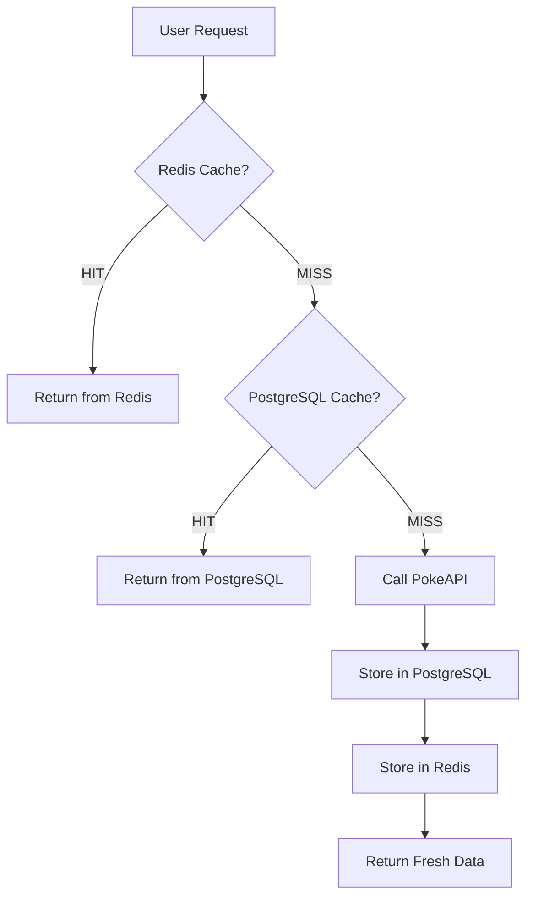

# React Pokédex

A modern, feature-rich Pokédex application built with React, TypeScript, and Tailwind CSS. This application provides comprehensive information about Pokémon, including detailed stats, evolutions, moves, and trading cards.

## Features

### Core Features
- **User Authentication**: Email/password and Google login with secure HttpOnly cookies.
- **Personal Favorites**: Save your favorite Pokémon to your collection.
- **User Profiles**: Customizable usernames and avatars with automatic profile creation and unique **Friend Codes**.
- **Social System**:
  - **Friend System**: Search users by username or code, send/accept friend requests, and view friends' favorite Pokémon and game stats.
  - **Real-time Notifications**: Instant alerts for friend requests and game updates via Supabase Real-time.
- **Team Builder**: Create and manage custom Pokémon teams with detailed configurations (moves, EVs, IVs, nature, items, Tera type).
- **Pokemon Grid Challenge**: Daily Pokédoku-style puzzle game with hints, global leaderboards, and an achievement system.
- **Infinite Scrolling**: Seamless browsing through the entire Pokémon database.
- **Advanced Filtering**: Multi-criteria search with types, moves, generation, stats, size, and evolution stage.
- **Detailed Pages**: Comprehensive Pokémon information with stats, evolutions, moves, and type effectiveness.
- **Trading Card Game**: View and interact with high-quality Pokémon trading cards.
- **SEO Optimized**: Dynamic metadata and canonical URLs for every Pokémon.
- **Fully Responsive**: Polished animations and mobile-first design.

## Technologies Used

- **Frontend Framework**: React 18 with TypeScript
- **Styling**: Tailwind CSS
- **Routing**: React Router v7
- **State Management**: Zustand (Game/UI) & Context API (Auth)
- **Data Fetching**: GraphQL & REST with PokeAPI
- **Authentication**: Supabase Auth
- **Database**: Supabase PostgreSQL with Row Level Security (RLS)
- **Caching**: 
  - **Upstash Redis**: Serverless Redis for sub-10ms response times.
  - **Supabase Edge Functions**: Tier 2 caching with PostgreSQL fallback.
- **Performance Optimization**: Intersection Observer, Debouncing, React.memo, and Multi-tier Caching.
- **Testing**: Jest with **508+ test cases**, covering unit, integration, and E2E scenarios.
- **CI/CD**: GitHub Actions with Semantic Release and automated deployments to Netlify.

## 🔄 CI/CD & Automation

The project employs a robust CI/CD pipeline to ensure code quality and automate the release process.

### Pipeline Workflow (`.github/workflows/ci-cd.yml`)

1.  **Test & Lint**: Executes `eslint` and the full suite of Jest tests (`npm run test:ci`) on every push.
2.  **Automated Versioning (Semantic Release)**: Automatically determines version numbers (SemVer) based on **Conventional Commits** (`feat`, `fix`, `perf`, `BREAKING CHANGE`).
3.  **Release Automation**: Updates `package.json`, generates `CHANGELOG.md`, creates Git tags, and publishes GitHub Releases.
4.  **Automated Deployment**: Builds and deploys the application to **Netlify** following a successful release.
5.  **Daily Grid Generation**: Scheduled GitHub Action (`daily-pokegrid.yml`) generates deterministic puzzle configurations for the PokéGrid Challenge every 24 hours.

## 🚀 Multi-Tier Caching System

This application features a sophisticated **multi-tier caching system** to optimize performance and reduce external API costs.

### Architecture



- **Tier 1: Upstash Redis**: Primary cache for ultra-low latency (<10ms).
- **Tier 2: Supabase Edge Functions**: Secondary cache using PostgreSQL's `api_cache` table.
- **Tier 3: PokeAPI**: Source of truth, called only on double cache misses.

## Recent Improvements (2025-2026)

### 2026 Q1 - Social & UI Refinement
- **👥 Comprehensive Friend System**: Integrated friend codes, user search, and social statistics.
- **🔔 Real-time Notifications**: Implemented a notification system with live updates for social interactions.
- **🎮 PokéGrid Enhancements**: Added a **Hint System**, **Weekly Stats**, and **Result Sharing** functionality.
- **🧪 Testing Milestone**: Expanded test suite from 68 to **508 passing tests**, reaching high coverage in core business logic.
- **🧹 Architecture Clean-up**: Centralized API logic and reduced code duplication by ~40% through reusable hooks and utility functions.

### 2025 Q4 - Core Game & Infrastructure
- **⚡ Redis Integration**: Implemented the multi-tier caching system with Upstash.
- **🏗️ Team Builder**: Launched the full-featured team management system.
- **🔐 Enhanced Security**: Refined RLS policies and implemented secure authentication flows.

## Getting Started

### Prerequisites
- Node.js 18+
- Docker Desktop (for local Supabase)
- Upstash Redis Account

### Setup
1. `git clone https://github.com/Drivakos/react-pokedex.git`
2. `npm install`
3. `cp .env.example .env` (Update with your credentials)
4. `npx supabase start`
5. `npm run dev`

## Project Structure

```
src/
├── components/          # UI Components
│   ├── auth/            # Authentication
│   ├── filters/         # Search Filters
│   ├── friends/         # Social Features
│   ├── pokegrid/        # Grid Challenge Game
│   └── teams/           # Team Builder
├── contexts/            # React Contexts (Auth)
├── hooks/               # Custom Hooks (usePokemon, useSearch, etc.)
├── lib/                 # External Integrations (Supabase, Redis)
├── services/            # API & Business Logic Layer
├── store/               # State Management (Zustand)
├── types/               # TypeScript Definitions
└── utils/               # Utility & Transformation Logic
supabase/
├── functions/           # Edge Functions (Caching, Scheduling)
└── migrations/          # Database Schema (RLS, Social, Game)
tests/                   # Comprehensive Test Suite (508+ tests)
```

## Useful Commands
- `npm test`: Run all tests.
- `npm run build:prod`: Production build with optimizations.
- `npx supabase db reset`: Reset local database.
- `node scripts/trigger-daily-grid.js`: Manually generate today's PokéGrid.
