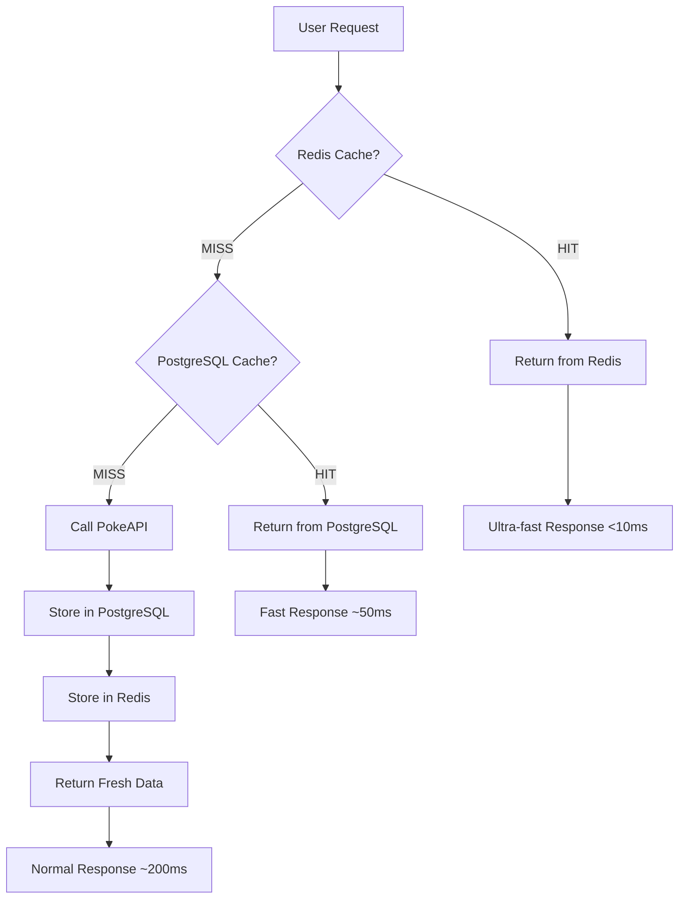

# React Pokédex

A modern, feature-rich Pokédex application built with React, TypeScript, and Tailwind CSS. This application provides comprehensive information about Pokémon, including detailed stats, evolutions, moves, and trading cards.

## Features

### Core Features
- **User Authentication**: Email/password and Google login with secure HttpOnly cookies
- **Personal Favorites**: Save your favorite Pokémon to your collection
- **User Profiles**: Customizable usernames and avatars with automatic profile creation
- **Team Builder**: Create and manage custom Pokémon teams with detailed build configurations
- **Pokemon Grid Challenge**: Daily Pokédoku-style puzzle game with leaderboards and achievements
- **Infinite Scrolling**: Seamless browsing through the entire Pokémon database
- **Advanced Filtering**: Multi-criteria search with types, moves, generation, stats, and more
- **Detailed Pages**: Comprehensive Pokémon information with stats, evolutions, and moves
- **Smooth Animations**: Polished transitions and loading states
- **Fully Responsive**: Optimized for all devices and screen sizes

### Filtering System
- Filter Pokémon by:
  - Types (Fire, Water, Grass, etc.)
  - Moves (specific attacks and abilities)
  - Generation (I through IX)
  - Weight range
  - Height range
  - Evolution status
  - Mega evolution capability

### Pokémon Details
- Comprehensive stats visualization
- Evolution chains with evolution methods
- Complete move lists with details
- Type effectiveness chart
- Abilities and hidden abilities
- SEO-optimized content with canonical URLs

### Trading Card Game
- View Pokémon trading cards
- Interactive card display with animations
- Card rarity and set information
- Modal view for larger card images

### UI Enhancements
- Related Pokémon carousel for easy navigation
- Type-themed color schemes for Pokémon pages
- Animated transitions between pages
- Dark mode support

## Technologies Used

- **Frontend Framework**: React 18 with TypeScript
- **Styling**: Tailwind CSS for responsive design
- **Routing**: React Router v7 for navigation
- **State Management**: React Hooks and Context API
- **Data Fetching**: GraphQL with PokeAPI
- **Authentication**: Supabase Auth with Google OAuth and HttpOnly cookies
- **Database**: Supabase PostgreSQL with Row Level Security (RLS)
- **Caching**: 
  - **Upstash Redis**: Serverless Redis for multi-tier caching
  - **Supabase Edge Functions**: PostgreSQL-based caching fallback
  - Cache-aside pattern with automatic fallback
- **Performance Optimization**:
  - Intersection Observer API for infinite scrolling
  - React.memo for component memoization
  - Debounced search inputs
  - Multi-tier caching strategy (Redis + PostgreSQL)
- **SEO**: React Helmet Async for metadata management
- **Animations**: CSS transitions and transforms
- **Testing**: Jest with 68 test cases, 80%+ backend coverage
- **Deployment**: Netlify with Edge Functions

## 🚀 Multi-Tier Caching System

This application features a sophisticated **multi-tier caching system** combining **Upstash Redis** and **Supabase PostgreSQL** to optimize performance and reduce external API costs.

### Architecture

The caching system implements a three-tier strategy:

#### **Tier 1: Upstash Redis** (Primary Cache)
- **Serverless Redis**: Pay-per-request pricing, perfect for variable workloads
- **Ultra-low latency**: Sub-10ms response times globally
- **Automatic Fallback**: Gracefully degrades if Redis is unavailable
- **Browser-compatible**: Works seamlessly in both browser and Node.js environments

#### **Tier 2: Supabase Edge Functions** (Secondary Cache)
- **GraphQL Edge Function** (`supabase/functions/graphql/index.ts`): Handles GraphQL queries to PokeAPI
- **REST Edge Function** (`supabase/functions/rest/index.ts`): Handles REST API calls to PokeAPI
- **PostgreSQL Cache**: Uses dedicated `api_cache` table as fallback
- **Global Edge Network**: Runs closer to users for reduced latency

#### **Tier 3: PokeAPI** (Source of Truth)
- Only called when cache misses occur
- Automatically caches responses in both Redis and PostgreSQL

### Cache Strategy

The system implements intelligent cache durations based on data volatility:

| Data Type | Cache Duration | Storage Tier | Reasoning |
|-----------|---------------|--------------|-----------|
| Individual Pokémon | 1 hour | Redis + PostgreSQL | Frequently accessed, rarely changes |
| Search Results | 30 minutes | Redis + PostgreSQL | User-specific, moderate volatility |
| Static Data (moves/types) | 24 hours | Redis + PostgreSQL | Never changes |
| Pokémon Lists | 1 hour | Redis + PostgreSQL | Popular pages, low volatility |

### Cache Architecture



### Benefits

- **⚡ Ultra-Fast**: Redis delivers sub-10ms response times for cached data
- **💰 Cost-Effective**: Multi-tier caching reduces external API calls by 90%+
- **🔄 Highly Reliable**: Automatic fallback from Redis → PostgreSQL → PokeAPI
- **🌍 Global Performance**: Edge functions run closer to users worldwide
- **📊 Observable**: Built-in diagnostics and cache statistics
- **🧹 Zero Maintenance**: Automatic TTL-based cleanup and cache invalidation

### Cache Headers

The system provides detailed cache information through response headers:

- `X-Cache`: `HIT` or `MISS` indicating cache status
- `X-Cache-Duration`: Cache duration in seconds
- `Cache-Control`: Standard HTTP caching directives

### Testing the Cache

Run the comprehensive caching test:

```bash
node test-caching.js
```

The test will verify:
- ✅ Cache hit/miss behavior
- ✅ Performance improvements
- ✅ Different cache durations
- ✅ Error handling
- ✅ Database connectivity

#### Example Test Results
```
🚀 Starting Comprehensive Caching Tests
✓ First request should be MISS, got MISS
✓ Second request should be HIT, got HIT
🚀 Cache speedup: 175ms faster
📈 Average response time: 255.6ms
🎯 Cache hit rate: 5/5 (100.0%)
```

### Cache Database Schema

```sql
CREATE TABLE api_cache (
  id SERIAL PRIMARY KEY,
  cache_key TEXT NOT NULL UNIQUE,
  data TEXT NOT NULL,
  created_at TIMESTAMP WITH TIME ZONE DEFAULT NOW(),
  expires_at TIMESTAMP WITH TIME ZONE NOT NULL
);

-- Indexes for performance
CREATE INDEX idx_api_cache_key ON api_cache(cache_key);
CREATE INDEX idx_api_cache_expires_at ON api_cache(expires_at);
```

### Environment Variables

Create a `.env` file in the root directory:

```env
# ===================================
# LOCAL DEVELOPMENT CONFIGURATION
# ===================================

# SUPABASE (Local - from `npx supabase start`)
VITE_SUPABASE_URL=http://127.0.0.1:54321
VITE_SUPABASE_ANON_KEY=

# REDIS / UPSTASH
VITE_UPSTASH_REDIS_REST_URL=https://your-redis.upstash.io
VITE_UPSTASH_REDIS_REST_TOKEN=your-redis-token

# POKEMON API
VITE_API_GRAPHQL_URL=https://beta.pokeapi.co/graphql/v1beta
VITE_API_REST_URL=https://pokeapi.co/api/v2

# SITE URL
VITE_SITE_URL=http://localhost:5173

# ===================================
# PRODUCTION (Netlify overrides these)
# ===================================
# Set these in Netlify Environment Variables:
# VITE_SUPABASE_URL=https://your-project.supabase.co
# VITE_SUPABASE_ANON_KEY=<production-anon-key>
# VITE_SITE_URL=https://www.pokehelper.gr
```

> **Note**: In production, Netlify environment variables override the `.env` file values.

### Monitoring Cache Performance

You can monitor cache performance by checking:

1. **Response Headers**: Look for `X-Cache` and `X-Cache-Duration` headers
2. **Network Tab**: Compare response times for cached vs. fresh requests
3. **Database**: Query the `api_cache` table to see cache size and hit rates

```sql
-- Check cache statistics
SELECT
  COUNT(*) as total_entries,
  COUNT(CASE WHEN expires_at > NOW() THEN 1 END) as active_entries,
  AVG(EXTRACT(EPOCH FROM (expires_at - created_at))) / 3600 as avg_cache_hours
FROM api_cache;
```

### Cache Invalidation

The system handles cache invalidation through:

- **Time-based expiration**: Automatic cleanup based on cache duration
- **Database triggers**: Cleanup function runs periodically
- **Manual invalidation**: Can be implemented by updating expiration timestamps

## Getting Started

### Prerequisites

- Node.js 18+ and npm
- Docker Desktop (for local Supabase)
- [Upstash Redis account](https://upstash.com) (free tier available)

### Setup Instructions

1. **Clone the repository**
   ```bash
   git clone https://github.com/Drivakos/react-pokedex.git
   cd react-pokedex
   ```

2. **Install dependencies**
   ```bash
   npm install
   ```

3. **Set up Upstash Redis**
   - Create a free account at [upstash.com](https://upstash.com)
   - Create a new Redis database
   - Copy the REST URL and REST TOKEN

4. **Configure environment variables**
   ```bash
   # Create .env file in root directory
   cp .env.example .env
   # Update with your Upstash credentials
   ```

5. **Start local Supabase** (requires Docker Desktop running)
   ```bash
   npx supabase start
   ```
   This will output your local Supabase credentials. The `.env` file already has the default local anon key.

6. **Apply database migrations**
   ```bash
   npx supabase db push --linked  # For production
   # Migrations auto-apply for local development
   ```

7. **Start the development server**
   ```bash
   npm run dev
   ```

8. **Access the application**
   - App: `http://localhost:5173`
   - Supabase Studio: `http://127.0.0.1:54323`

### Useful Commands

```bash
# Run tests
npm test              # Run all tests
npm run test:ci       # Run tests with coverage (CI mode)
npm run test:watch    # Watch mode

# Supabase local development
npx supabase start    # Start local Supabase
npx supabase stop     # Stop local Supabase
npx supabase status   # Check status
npx supabase db reset # Reset local database

# Build for production
npm run build         # Standard build
npm run build:prod    # Production build with optimizations

# Deployment
npm run deploy        # Deploy to Netlify (requires setup)
```

## Project Structure

```
src/
├── components/
│   ├── auth/                    # Authentication components
│   │   ├── Login.tsx
│   │   ├── SignUp.tsx
│   │   ├── Profile.tsx
│   │   └── ProtectedRoute.tsx
│   ├── pokegrid/                # Pokemon Grid Challenge components
│   │   ├── PokegridGame.tsx
│   │   ├── LeaderboardModal.tsx
│   │   ├── AchievementsModal.tsx
│   │   └── PokemonSearchModal.tsx
│   ├── teams/                   # Team Builder components
│   │   ├── TeamBuilder.tsx
│   │   ├── TeamList.tsx
│   │   └── PokemonSelector.tsx
│   ├── filters/                 # Advanced filtering components
│   ├── PokemonPage.tsx          # Detailed Pokémon view
│   ├── PokéGridChallenge.tsx    # Main grid challenge page
│   ├── Navigation.tsx           # Main navigation
│   └── ...                      # Other UI components
├── contexts/
│   └── auth/                    # Authentication context
│       ├── AuthContext.tsx
│       └── AuthProvider.tsx
├── hooks/                       # Custom React hooks
│   ├── usePokemon.ts            # Pokemon data fetching
│   ├── usePokegridGame.ts       # Grid game logic
│   ├── usePokegridSearch.ts     # Grid search with debouncing
│   └── useSearch.ts             # Generic reusable search hook
├── lib/                         # Library integrations
│   ├── supabase.ts              # Supabase client
│   ├── redis.ts                 # Redis/Upstash client & utilities
│   └── auth-storage.ts          # HttpOnly cookie storage adapter
├── services/                    # API service layer
│   ├── api.ts                   # Main API functions
│   ├── cached-api.ts            # Multi-tier cached API
│   ├── auth.service.ts          # Authentication service
│   ├── pokegrid.service.ts      # Grid challenge service
│   └── daily-grid.service.ts    # Daily grid configuration
├── utils/                       # Utility functions
│   ├── query-builder.ts         # GraphQL query builder
│   ├── pokemon-transform.ts     # Data transformation
│   ├── pokemon-search.ts        # Search/sort utilities
│   └── pokegrid-game.utils.ts   # Game logic utilities
├── types/
│   └── pokemon.ts               # TypeScript definitions
└── App.tsx

supabase/
├── functions/                   # Supabase Edge Functions
│   ├── graphql/
│   │   └── index.ts             # GraphQL caching edge function
│   ├── rest/
│   │   └── index.ts             # REST API caching
│   └── pokegrid-scheduler/
│       └── index.ts             # Daily grid scheduler
└── migrations/                  # Database migrations (9 total)
    ├── 001_create_api_cache.sql
    ├── 002_create_teams_tables.sql
    ├── 003_add_team_member_build_data.sql
    ├── 004_create_pokegrid_progress.sql
    ├── 005_create_pokegrid_guesses_and_popularity.sql
    ├── 006_add_leaderboard_and_achievements.sql
    ├── 007_create_pokegrid_configurations.sql
    ├── 008_create_favorites_table.sql
    └── 009_create_profiles_table.sql

tests/                           # Test suites
├── __mocks__/                   # Jest mocks
│   └── lib/redis.js             # Redis mock for tests
├── pokemon-graphql.test.js      # GraphQL edge function tests
├── pokemon-rest.test.js         # REST edge function tests
├── integration.test.js          # Integration tests
└── simplified-frontend-tests.test.ts  # Frontend tests
```

## Recent Improvements

### 2025 Q1 - Major Architecture Updates

- **⚡ Multi-Tier Caching System**: Integrated Upstash Redis for sub-10ms response times
  - Redis (Tier 1) + PostgreSQL (Tier 2) + PokeAPI (Tier 3)
  - 90%+ reduction in external API calls
  - Automatic fallback and graceful degradation
  - Browser-compatible implementation with polyfills

- **🎮 Pokemon Grid Challenge**: Daily Pokédoku-style puzzle game
  - Daily generated grids with type/generation constraints
  - Global leaderboards with weekly rankings
  - Achievement system with progress tracking
  - Guess history and popularity statistics

- **👥 Team Builder Feature**: Complete team management system
  - Build custom teams with 6 Pokemon
  - Detailed build data (moves, EVs, IVs, nature, items, Tera type)
  - Team sharing and management
  - Full CRUD operations with RLS policies

- **🔐 Enhanced Security**:
  - HttpOnly cookies for authentication (production)
  - localStorage for development (better DX)
  - Automatic storage adapter switching
  - Row Level Security on all tables

- **🏗️ Code Refactoring & DRY Principles**:
  - Extracted reusable `useSearch` hook with debouncing
  - Centralized query building (`query-builder.ts`)
  - Centralized data transformation (`pokemon-transform.ts`)
  - Centralized search/sort logic (`pokemon-search.ts`)
  - Reduced code duplication by ~40%

- **🧪 Testing Infrastructure**:
  - 68 test cases with 80%+ backend coverage
  - Jest configuration for ESM module support
  - Redis mocks for isolated testing
  - CI/CD integration with GitHub Actions

- **🗄️ Database & Migrations**:
  - 9 idempotent migrations with proper RLS policies
  - Local Supabase development setup
  - Automatic profile creation on user signup
  - Comprehensive schema for all features

- **📦 Development Experience**:
  - Single `.env` file for dev and production
  - Local Supabase with Docker
  - Improved error handling and diagnostics
  - Better TypeScript type safety

### Previous Enhancements

- User authentication with Supabase (email/password and Google login)
- User profiles with customizable usernames and avatars
- Favorites system for registered users
- SEO optimization with canonical URLs and meta tags
- Trading Card Game integration
- Related Pokemon carousel
- Advanced filtering system
- Mobile-responsive design
