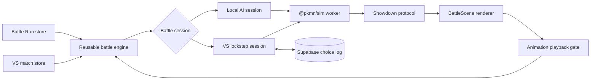
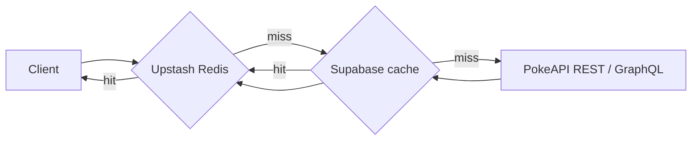

# Pokédex Battle Platform

[](https://github.com/Drivakos/react-pokedex/actions/workflows/ci-cd.yml)
[](https://pokehelper.gr)
[](https://react.dev/)
[](https://www.typescriptlang.org/)

A full-stack Pokémon fan project that combines a searchable Pokédex, competitive team builder, daily puzzle, social features, a roguelike Battle Run, and live friend battles.

The technically distinctive part is the battle platform: Pokémon Showdown's simulator runs inside a browser worker, its real client renders the battle scene, and the same reusable engine supports both local AI encounters and synchronized multiplayer matches.

**[Open the live app](https://pokehelper.gr)**

## What makes this project interesting

- **Real in-browser battle simulation.** `@pkmn/sim` runs off the main thread while the Pokémon Showdown client receives the live protocol stream and renders authentic sprites, effects, cries, and battle audio.
- **Reusable battle architecture.** A narrative-free engine owns one battle; Battle Run and VS mode provide their own progression or networking state without coupling it to the simulator.
- **Animation-aware game pacing.** The worker can resolve a turn immediately, but decisions and results are released only after the Showdown scene's real animation queue becomes idle.
- **Deterministic multiplayer lockstep.** Both players simulate the same seeded battle locally while Supabase acts as a durable choice rendezvous and reconnect log.
- **Production-oriented backend.** Supabase Auth, PostgreSQL Row Level Security, Realtime, migrations, Netlify Functions, Upstash Redis, scheduled jobs, and Sentry support the client application.
- **Substantial automated coverage.** The current suite contains **631 passing tests across 65 suites**, split into frontend, backend, and integration Jest projects.

## Product areas

| Area | Highlights |
| --- | --- |
| Pokédex | Infinite browsing, advanced filters, detailed stats, evolutions, moves, type effectiveness, and TCG cards |
| Team builder | Six-member teams, moves, abilities, items, natures, EVs, IVs, levels, nicknames, shinies, gender, Tera types, recommended builds, reordering, and Showdown export |
| Battle Run | Autosaved 15-stage roguelike runs, route choices, team drafts, rewards, upgrades, difficulty scaling, AI profiles, and themed arenas |
| VS Battles | Authenticated friend invitations, immutable team snapshots, readiness lobbies, deterministic synchronized turns, reconnect support, and forfeits |
| PokéGrid | Deterministic daily puzzles, hints, rarity-aware scoring, achievements, sharing, historical grids, and worldwide/friend leaderboards |
| Social | Profiles, favorites, friend codes, requests, presence, realtime notifications, and friend game statistics |

## Battle architecture


```mermaid
flowchart LR
    Run[Battle Run store] --> Engine[Reusable battle engine]
    VS[VS match store] --> Engine

    Engine --> Session{Battle session}
    Session --> AI[Local AI session]
    Session --> Lockstep[VS lockstep session]

    AI --> Worker["@pkmn/sim worker"]
    Lockstep --> Worker
    Lockstep <--> Supabase[(Supabase choice log)]

    Worker --> Protocol[Showdown protocol]
    Protocol --> Scene[BattleScene renderer]
    Scene --> Gate[Animation playback gate]
    Gate --> Engine
```

`src/store/battleEngineStore.ts` owns simulator state, commands, protocol subscriptions, error recovery, and scene pacing for exactly one battle. Narrative stores own everything around that battle—run progress, stages, routes, lobbies, participants, and rewards.

The session boundary makes the transport replaceable. Battle Run injects the local AI session; VS mode injects a synchronized session that applies completed host/guest choice pairs in canonical order on both clients.

## Data and caching

Pokédex requests can fall through multiple data layers instead of repeatedly hitting the upstream API:


```mermaid
flowchart LR
    Client --> Redis{Upstash Redis}
    Redis -->|hit| Client
    Redis -->|miss| Postgres{Supabase cache}
    Postgres -->|hit| Redis
    Postgres -->|miss| PokeAPI["PokeAPI REST / GraphQL"]
    PokeAPI --> Postgres
    Postgres --> Redis
```

- Upstash Redis provides the first serverless cache layer.
- Supabase PostgreSQL provides persistent fallback storage.
- Netlify and Supabase functions proxy external REST and GraphQL requests.
- Search debouncing, infinite scrolling, memoized components, and route-level lazy loading reduce client work.

## Stack

- **Frontend:** React 18, strict TypeScript, React Router, Zustand, Tailwind CSS
- **Battle engine:** `@pkmn/sim`, `@pkmn/client`, `@pkmn/data`, Pokémon Showdown BattleScene, Web Workers
- **Backend:** Supabase Auth, PostgreSQL, RLS, Realtime, Edge Functions, Netlify Functions
- **Data:** PokeAPI REST and GraphQL, Smogon sets, Random Battle roles, Pokémon TCG data
- **Caching and monitoring:** Upstash Redis, Sentry
- **Testing:** Jest, React Testing Library, jsdom, Node integration projects
- **Delivery:** GitHub Actions, semantic-release, Netlify

## Quality and delivery

At version **1.22.2**, the repository passes:

```text
Test Suites: 65 passed, 65 total
Tests:       631 passed, 631 total
TypeScript:  passed
Build:       passed
```

The main CI workflow installs from the lockfile on Node 20, runs ESLint and the complete Jest suite, publishes semantic releases from Conventional Commits, and deploys successful `main` builds to Netlify.

## Engineering tradeoffs

- **VS mode is casual and unranked.** Deterministic browser lockstep supports friend battles and reconnects, but a modified client cannot be treated as trusted. Ranked play would require a server-authoritative simulator.
- **Auth is client-rendered.** Supabase PKCE sessions are persisted through the browser storage adapter, while database access is constrained with RLS policies.
- **Battle dependencies are large.** Simulator and competitive-set data are isolated from the initial Pokédex route through lazy loading; reducing those on-demand bundles remains a performance opportunity.
- **Showdown assets require same-origin proxies.** Development and production both expose `/ps` before the Showdown data scripts load so sprites, effects, backdrops, and audio remain compatible with the site's CSP.

## Getting started

### Prerequisites

- Node.js 20
- npm
- Docker Desktop for the local Supabase stack

### Setup

```bash
git clone https://github.com/Drivakos/react-pokedex.git
cd react-pokedex
npm ci
cp .env.example .env
npx supabase start
npm run dev
```

Vite runs at [http://localhost:64444](http://localhost:64444). Add your local Supabase URL and anonymous key to `.env`; optional Upstash, Pokémon TCG, Sentry, and deployment values are documented in `.env.example`.

## Useful commands

| Command | Purpose |
| --- | --- |
| `npm run dev` | Start the Vite development server |
| `npm run build` | Type-check and create the production bundle |
| `npm run lint` | Run ESLint across the repository |
| `npm test` | Run all Jest projects |
| `npm run test:ci` | Run the CI test suite with coverage |
| `npm run balance:run` | Simulate complete Battle Runs for balance analysis |
| `npm run generate:battle-catalog` | Rebuild the generated battle catalogue |
| `npx supabase db reset` | Recreate the local database from migrations |

## Project structure

```text
src/
├── components/
│   ├── battle-game/      # Battle Run screens, Showdown scene, and visual effects
│   ├── pokegrid/         # Daily puzzle UI
│   ├── teams/            # Team collection and competitive build editor
│   ├── vs/               # Friend battle invitation, lobby, and match screens
│   ├── friends/          # Friend and notification interfaces
│   └── pokemon-page/     # Detailed Pokédex pages
├── store/                # Battle engine and feature-specific Zustand stores
├── services/             # APIs, battle sessions, multiplayer, social, and caching logic
├── workers/              # Browser-hosted Pokémon simulator
├── hooks/                # Reusable React behavior
├── lib/                  # Supabase, Redis, and auth integrations
├── types/                # Shared TypeScript contracts
└── utils/                # Domain rules and transformations
supabase/
├── functions/            # REST, GraphQL, and PokéGrid Edge Functions
└── migrations/           # Database schema, RLS, social, team, grid, and VS migrations
netlify/functions/        # Production API and image proxies
tests/                    # Backend and cross-feature integration coverage
```

## Legal and attribution

This is a non-commercial fan project created for educational and portfolio purposes. Pokémon and Pokémon character names are trademarks of Nintendo. Pokémon assets belong to Nintendo, The Pokémon Company, Game Freak, Creatures, and their respective owners.

The application uses data or assets from [PokeAPI](https://pokeapi.co/), [Pokémon Showdown](https://pokemonshowdown.com/), [Smogon](https://www.smogon.com/), and the [Pokémon TCG API](https://pokemontcg.io/). Asset-specific attribution is included alongside the relevant files under `public/images/`.
