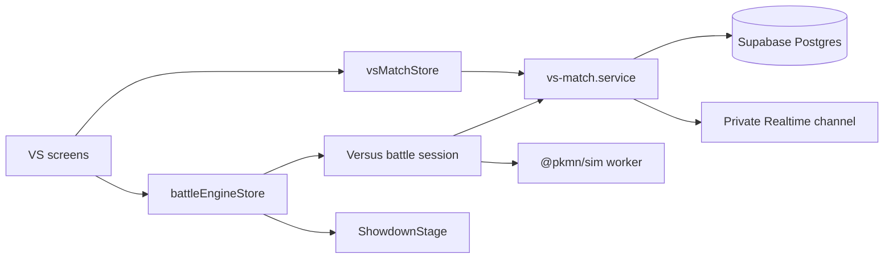

# VS Mode — Product and Technical Draft

Status: foundation and invite lobby implemented; live synchronized battle pending

Implementation progress:

- Complete saved-team normalization and validation, including IVs and presentation fields.
- Injectable battle-session boundary with Battle Run regression coverage.
- Authenticated invite creation, inspection, atomic acceptance, readiness, cancellation, and immutable level-50 team snapshots.
- Participant-only match reads, hashed single-use invite secrets, protected routes, Realtime lobby refresh, and lobby UI.
- Next: durable choice windows/resolutions, deterministic VS worker/session, reconnect replay, and reusable VS battle screen.

## Product goal

Let a signed-in player choose one of their saved teams, create a private invite link, and play a live 1v1 battle against a friend using the existing Pokémon Showdown battle presentation.

The first release is a casual friend-battle mode. It should be reliable across refreshes and brief disconnects, but it is not a ranked or cheat-resistant mode.

## MVP decisions

- Both players must sign in. The invite link survives the login redirect.
- Battles use saved teams with 1–6 valid members.
- Creating an invite locks a snapshot of the host's team. Accepting it locks a snapshot of the guest's team. Later team edits do not change the match.
- One invite can be accepted once and expires after 30 minutes if unused.
- No spectators, matchmaking, chat, rematches, rankings, or turn timer in the first release.
- A player may forfeit. A disconnected player can rejoin from the same URL.
- Team species are revealed when both players are locked in; moves, items, abilities, EVs, and IVs are only revealed naturally through battle events in the UI.

## User flow

### Host

1. Open **Games → VS Battle** (`/vs`).
2. Select a valid saved team.
3. Choose **Create invite**.
4. Copy or share the generated link: `/vs/invite/<opaque-token>`.
5. Wait in the lobby while the friend joins and chooses a team.
6. Confirm **Ready**. The battle starts when both players are ready.

### Guest

1. Open the invite link.
2. Sign in if needed, returning to the same invite afterward.
3. See the host's display name and the battle rules, but not the host's private team build.
4. Select a valid saved team and accept the invitation.
5. Confirm **Ready** and enter the battle.

### End states

- Win, loss, tie, or forfeit result.
- **Back to VS** returns to `/vs`.
- **Rematch** is deferred; initially players create a fresh invite.

## UX states

The VS screen should explicitly render these states instead of relying on toasts:

| State | Primary UI |
| --- | --- |
| No valid teams | Explain the requirements and link to the team builder |
| Creating | Disable duplicate submission and show progress |
| Waiting for friend | Invite URL, Copy, native Share when available, Cancel |
| Invite invalid/expired | Clear explanation and link to `/vs` |
| Invite belongs to current user | Resume the host lobby instead of accepting it |
| Team selection | Saved-team cards with inline validation errors |
| Waiting for ready | Both player names and independent readiness indicators |
| Battle | Reuse the current Showdown stage, controls, log, audio, and animation gate |
| Reconnecting | Keep the battle screen mounted and replay persisted resolutions |
| Opponent disconnected | Show connection status; do not award a win automatically in MVP |
| Finished | Result summary and navigation actions |

## Architecture

The existing `battleEngineStore` remains the single-battle UI engine, and a new `vsMatchStore` owns invite/lobby/match state. VS is another narrative around the battle; VS-only state must not be added to `battleEngineStore`.



### Why deterministic lockstep for the MVP

The current simulator runs inside a browser worker and the existing backend has no long-lived authoritative battle process. For the MVP, both clients run the same `@pkmn/sim` version with the same server-generated seed and apply the same ordered choice resolutions. This produces the same protocol on both clients.

This approach fits the current Supabase and Netlify architecture and supports reconnect by replaying the stored resolution log. It does not prevent a modified client from inspecting a full opponent team or lying about its simulation state, so it must remain explicitly unranked. Ranked play would require a server-authoritative, stateful battle service.

### Durable data versus live signals

- Postgres is the source of truth for invite status, participants, team snapshots, readiness, seed, ordered resolved choices, checkpoints, and result.
- A private Supabase Realtime channel (`vs:<match-id>`) sends low-latency notifications such as `participant_changed`, `resolution_ready`, `forfeit`, and presence.
- Realtime payloads are hints, never the only copy of battle data. On subscribe or reconnect, the client fetches the match and all resolutions after its last applied sequence.

## Battle engine changes

Introduce a session boundary instead of putting networking directly in the engine:

```ts
interface BattleSession {
  start(): void;
  chooseMove(slot: number): void;
  chooseSwitch(slot: number): void;
  forfeit(): void;
  dispose(): void;
}
```

- Keep the current AI session as the default implementation.
- Add a VS implementation that consumes both simulator player streams, but exposes decisions, snapshots, and protocol relative to the local participant (`p1` or `p2`).
- Extend the Showdown protocol subscription so it belongs to the active engine session rather than importing a Battle Run-specific global feed.
- Make `ShowdownStage` set the local perspective correctly for a guest playing as `p2`.
- Preserve the existing scene animation gate. A received resolution may advance the simulator immediately, but the next choice/result is released only after the Showdown scene becomes idle.

### Choice synchronization

Each simulator request window receives a monotonically increasing `sequence`. Both participants submit exactly once for every window. A participant whose simulator stream has no decision submits an explicit `pass`; this handles one-sided forced switches without trusting either browser to declare which sides are expected.

1. The local player selects a legal move or switch.
2. The client derives a canonical hash of the request window and calls `submit_vs_choice(match_id, sequence, request_hash, choice)`. `choice` is a move, switch, or `pass`.
3. A choice is not readable by the opponent before the resolution is complete.
4. When both submissions exist and their request hashes agree, the database publishes one ordered resolution. A request-hash mismatch marks the match `desynced`.
5. Each client fetches the resolution, applies each non-`pass` command to its local simulator, and stores a protocol checkpoint hash.
6. If checkpoint hashes disagree, pause the match as `desynced`; never guess which client is correct.

Forced switches are separate request windows. Duplicate submissions use `(match_id, sequence, participant_id)` as an idempotency key.

### Reconnect

On load or channel reconnection:

1. Fetch the match, local participant, snapshots, seed, and status.
2. Start a fresh VS worker using the pinned simulator/rules version.
3. Replay resolutions in sequence order.
4. Verify the latest checkpoint hash.
5. Resume the unresolved request window or finished result.

The URL used for an active match should be `/vs/match/:matchId`; the invite token is only for joining and should be removed from the address after successful acceptance.

## Proposed database model

### `vs_matches`

| Column | Notes |
| --- | --- |
| `id uuid` | Primary key, server-generated |
| `host_user_id uuid` | References `auth.users` |
| `guest_user_id uuid null` | Set atomically on accept |
| `status text` | `invited`, `lobby`, `active`, `finished`, `cancelled`, `expired`, `desynced` |
| `invite_token_hash text` | Hash only; never store the bearer token in plaintext |
| `invite_expires_at timestamptz` | Default 30 minutes |
| `host_team_snapshot jsonb` | Validated immutable battle set |
| `guest_team_snapshot jsonb null` | Added during accept |
| `host_ready boolean` | Default false |
| `guest_ready boolean` | Default false |
| `battle_seed jsonb null` | Generated only once when starting |
| `rules_version text` | Pins format and validation rules |
| `simulator_version text` | Pins compatible clients |
| `winner_user_id uuid null` | Null for tie/cancelled |
| `finish_reason text null` | `win`, `tie`, `forfeit`, `desync` |
| timestamps | `created_at`, `started_at`, `finished_at`, `updated_at` |

### `vs_choice_submissions`

Private input rows. Clients submit via RPC and cannot select raw opponent choices.

| Column | Notes |
| --- | --- |
| `match_id uuid` | Match foreign key |
| `sequence integer` | Request-window sequence |
| `user_id uuid` | Submitting participant |
| `side text` | `p1` or `p2` |
| `request_hash text` | Proves both clients are resolving the same request window |
| `choice text` | Canonical Showdown command or `pass`, validated for shape and length |
| `created_at timestamptz` | Audit timestamp |

Unique key: `(match_id, sequence, user_id)`.

### `vs_resolutions`

Durable ordered log readable only by the two participants.

| Column | Notes |
| --- | --- |
| `match_id uuid` | Match foreign key |
| `sequence integer` | Primary ordering key within match |
| `request_hash text` | Matching request-window hash |
| `p1_choice text` | Released only when both players submit |
| `p2_choice text` | Released only when both players submit |
| `created_at timestamptz` | Resolution timestamp |

Unique key: `(match_id, sequence)`.

### `vs_checkpoints`

| Column | Notes |
| --- | --- |
| `match_id uuid` | Match foreign key |
| `sequence integer` | Resolution being acknowledged |
| `user_id uuid` | Participant |
| `protocol_hash text` | Hash of canonical protocol/state projection |

Unique key: `(match_id, sequence, user_id)`.

### `vs_result_reports`

Both clients report the terminal result. The database finishes a normal match only when the reports agree.

| Column | Notes |
| --- | --- |
| `match_id uuid` | Match foreign key |
| `user_id uuid` | Reporting participant |
| `winner_side text` | `p1`, `p2`, or `tie` |
| `result_hash text` | Hash of the canonical terminal protocol/result |
| `created_at timestamptz` | Report timestamp |

Unique key: `(match_id, user_id)`.

## Database functions

Use `security definer` functions with a fixed `search_path`, explicit `auth.uid()` checks, and transaction-level locking for all state transitions:

- `create_vs_invite(team_id)` → validates ownership/build, snapshots the team, returns `{ match_id, invite_token, expires_at }`.
- `inspect_vs_invite(invite_token)` → returns only safe lobby metadata.
- `accept_vs_invite(invite_token, team_id)` → atomically claims the guest slot and snapshots the guest team.
- `set_vs_ready(match_id, ready)` → when both are ready, generates the seed and changes `lobby` to `active` once.
- `submit_vs_choice(match_id, sequence, request_hash, choice)` → idempotently records a participant choice and creates a resolution when both participants have submitted the same request hash.
- `ack_vs_checkpoint(match_id, sequence, protocol_hash)` → stores acknowledgement and marks a mismatch as `desynced`.
- `report_vs_result(match_id, winner_side, result_hash)` → records a terminal result and finishes the match only when both reports agree; a mismatch becomes `desynced`.
- `forfeit_vs_match(match_id)` and `cancel_vs_invite(match_id)`.
- A scheduled cleanup marks unused expired invites as `expired` and deletes old private submissions according to retention policy.

RLS should allow match and resolution reads only when `auth.uid()` is the host or guest. Team source rows remain private; only the RPCs may create snapshots. Private Realtime channel authorization should use the same participant membership check.

## Team validation and normalization

Validation happens on the server when each snapshot is created and again in the client for immediate feedback:

- 1–6 members, unique positions 1–6.
- Recognized species, ability, item, nature, Tera type, and 1–4 moves.
- Level 1–100; decide whether MVP preserves saved levels or normalizes all Pokémon to level 50. Recommended: normalize to level 50 for the first release.
- IVs 0–31; EVs 0–252 per stat and no more than 510 total.
- Convert database stat keys (`attack`, `special-attack`) to simulator keys (`atk`, `spa`) without dropping saved IVs. The current `toPokemonSet` always uses 31 IVs and must be corrected before VS.
- Apply a clear legality policy. Recommended MVP: Gen 9 Custom Game mechanics with structural validation, no species/item clause, and no competitive ban list.

Store normalized Showdown-compatible sets in snapshots, not only team-member row IDs. Include display-safe species data separately if the lobby needs a team preview.

## Client modules

Suggested additions:

```text
src/components/vs/
  VsHome.tsx
  VsInvite.tsx
  VsLobby.tsx
  VsBattle.tsx
  VsResult.tsx
src/services/vs-match.service.ts
src/services/showdown-versus-session.ts
src/workers/showdown-versus.worker.ts
src/store/vsMatchStore.ts
src/types/vs.ts
src/utils/vs-team-validation.ts
```

Routes:

- `/vs` — protected entry and team selection.
- `/vs/invite/:token` — preserves destination through auth, then inspects/accepts.
- `/vs/match/:matchId` — protected lobby, battle, reconnect, and result route.

Add **VS Battle** to both desktop and mobile Games menus.

## Security and privacy requirements

- Generate at least 128 bits of random invite-token entropy; store only a SHA-256 hash.
- Never put a team ID, user ID, email, or battle choices in an invite URL.
- Rate-limit invite creation, inspection, acceptance, and choice submission.
- Accept through one atomic database function so two guests cannot claim the same invite.
- Do not expose the raw `vs_choice_submissions` table through RLS.
- Validate state transitions and participant identity in the database, not only Zustand.
- Treat team snapshots and unresolved choices as private data.
- Mark the MVP as casual/unranked because browser lockstep is not authoritative.

## Failure policy

- Brief network loss: reconnect and replay persisted resolutions.
- Invalid/duplicate choice: reject without advancing the sequence and restore the decision UI.
- Simulator version mismatch: block start and ask the older client to refresh.
- Protocol checkpoint mismatch: set `desynced`, preserve diagnostics, and stop accepting choices.
- Host cancels before acceptance: invite becomes `cancelled`.
- Player leaves an active battle: keep it resumable; only an explicit forfeit ends it in MVP.
- Stale active match: expire after a conservative retention window (for example 24 hours), not after a short presence loss.

## Test plan

### Database

- RLS isolation between participant, authenticated non-participant, and anonymous users.
- Invite expiry, single-use acceptance race, team ownership, and atomic ready/start transitions.
- Hidden choices before resolution and idempotent duplicate submissions.
- Forfeit/result transitions and cleanup.

### Unit

- Team-member-to-Showdown-set normalization, including EV/IV key mapping.
- Choice sequence reducer, forced-switch windows, duplicate events, reconnect replay, and checkpoint hashing.
- Perspective normalization for both `p1` and `p2`.

### Integration

- Two independent clients create, accept, ready, and finish a deterministic battle.
- Refresh either client during lobby, a normal turn, a forced switch, and the final animation.
- Drop a Realtime event and prove the Postgres replay path catches up.
- Simultaneous invite acceptance and simultaneous move submission.
- Guest sees their own side as the player in controls, snapshot, log, and Showdown scene.

### Existing regression gates

- `npm run lint`
- focused VS and battle-engine Jest suites
- `npm run build`
- verify Battle Run still uses the AI session and retains its animation pacing

## Delivery slices

1. **Foundation:** fix complete team normalization/validation; introduce the battle-session boundary without changing Battle Run behavior.
2. **Invite lobby:** migrations, RPCs, RLS, routes, team selection, copy/share link, accept/cancel, readiness, and reconnecting lobby.
3. **Lockstep battle:** VS worker/session, ordered resolution log, private Realtime wakeups, player perspective, and Showdown UI reuse.
4. **Reliability:** checkpoint mismatch handling, refresh/replay tests, presence indicators, explicit forfeit, cleanup, and observability.
5. **Post-MVP:** rematch, direct friend challenge/notification, turn timers, spectators/replays, and a server-authoritative service if ranked play is desired.

## MVP acceptance criteria

- A signed-in host can select an existing valid team and copy a single-use invite link.
- A signed-in friend can open the link, select their own valid team, and join exactly once.
- Neither player can change the locked team by editing the original team.
- Both clients show the same ordered battle and can make all normal and forced-switch decisions.
- Refreshing either client reconstructs the current battle from persisted data.
- Both clients reach the same recorded result; an explicit forfeit is supported.
- Non-participants cannot read the match, snapshots, choices, or Realtime channel.
- Battle Run behavior and the Showdown asset/protocol/animation constraints remain intact.
